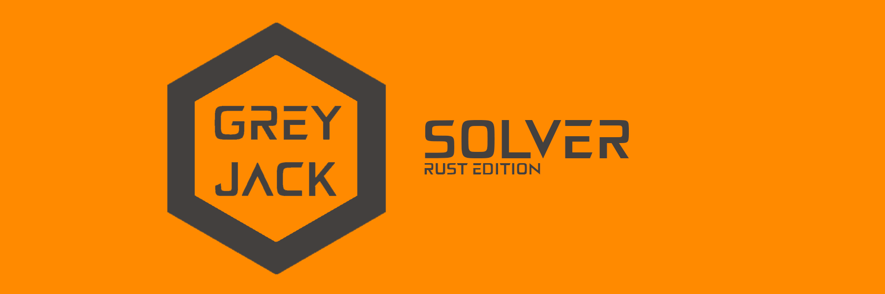

# Preview



_In optimum we trust._

GreyJack Solver is an AI constraint solver for Rust (current version) built on top of Polars. 
It empowers you to solve a wide range of constraint optimization problems, including continuous, integer, and mixed-integer challenges.

# Editions

There are 2 editions of GreyJack Solver:

- Rust version (this repo).
- [Python version](https://github.com/CameleoGrey/greyjack-solver-python) (in progress...).

# Key Features of GreyJack Solver (Rust version)

- **Great comfortability, expressiveness and flexibility** Thanks to Polars you can express almost all ideas of solutions for almost any problem. And if you need, you can describe some parts of constraints by plain Rust.
- **Universality** Supports multiple types of constraint problems (continuous, integer, mixed-integer).
- **Nearly linear horizontal scaling** Multi-threaded solving organized as collective work of individual agents (island computation model for all algorithms), which are sharing the results with neighbours during solving. It gives nearly linear horizontal scaling, increases quality and speed of solving (depends on agents settings and problem).
- **Supporting of population and local search algorithms** GreyJack currently implements GeneticAlgorithm, TabuSearch, LateAcceptance.
- **Clarity** GreyJack gives clear and straightforward approach to design, implement and improve enough effective solutions for almost any constraint problem and situation.
- **Easy integration** Observer mechanism (see examples).

# Get started with GreyJack Solver in Rust

```
cargo add greyjack
```

- Explore examples. Docs and guides will be later. GreyJack is very intuitively understandable solver (even Rust version).
- Simply solve your tasks simply.

# RoadMap

- Implement effective Python version (have some good ideas how to achieve it after working on Rust version)
- Composite termination criterion (for example: solving limit minutes N AND score not improving M seconds)
- Add more examples: Job-Shop, Pickup&Delivery, some continuous and MIP tasks, scheduling, etc
- SimulatedAnnealing
- Modern variations (modifications) of LSHADE (Differential evolution algorithms often appear in articles as sota approaches)
- CMA, probably its modern variants, adaptations for tasks with integer and categorical variables (often appears in articles as sota approach)
- Multi-level score
- Custom moves support
- Try to impove incremental (pseudo-incremental) score calculation mechanism (caching, no clonning, etc)
- Write docs
- Website
- Useful text materials, guides, presentations
- Tests, tests, tests...